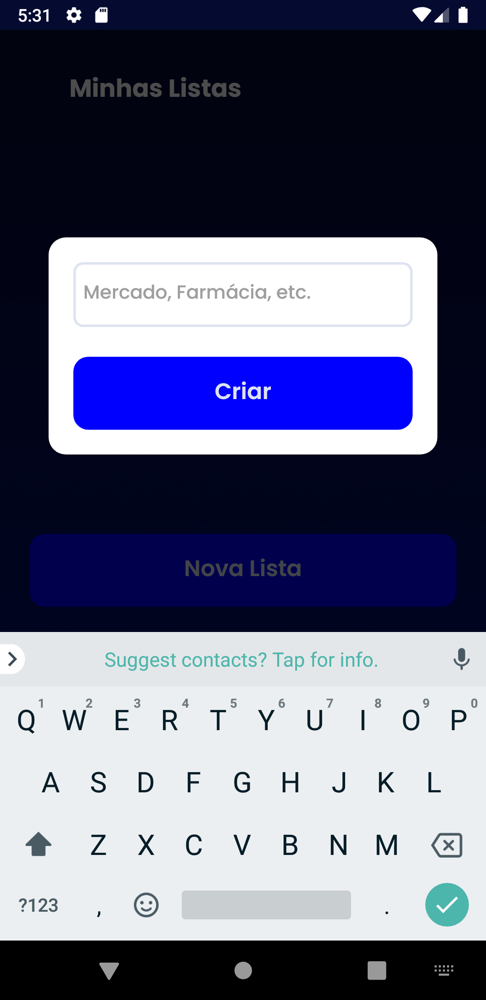
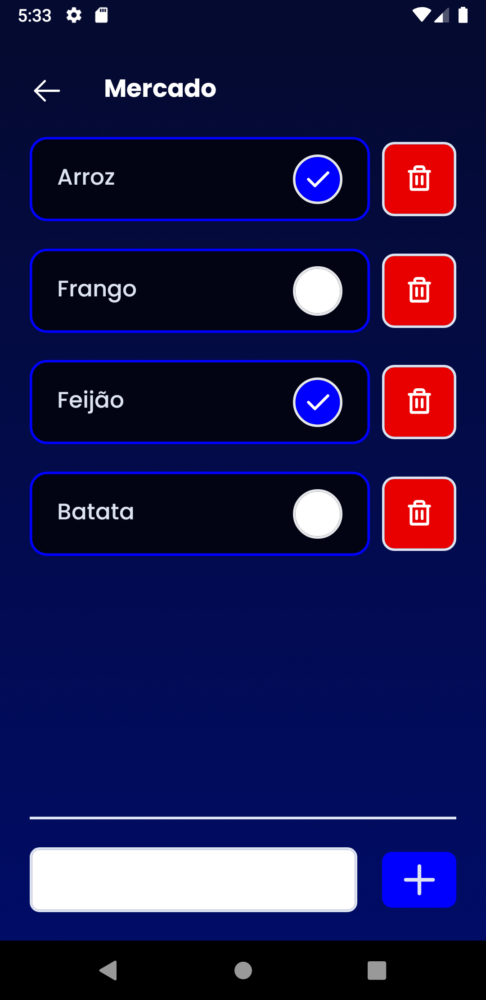

# 🚀 ShoppingList

ShoppingList is a is a mobile app developed for a study about RealmDB. It demonstrates how to use RealmDB in a React Native app, and includes basic CRUD operations.

## 🛠️ Installation

1. Clone the repository
2. Run `yarn` to install the dependencies
3. Run `yarn` to start the development server

## 🚀 Feature

- Offline database with RealmDB

## 🛡️ Technologies Used

- React Native
- RealmDB
- TypeScript

## 📱 Screenshots

  
  
  
  

